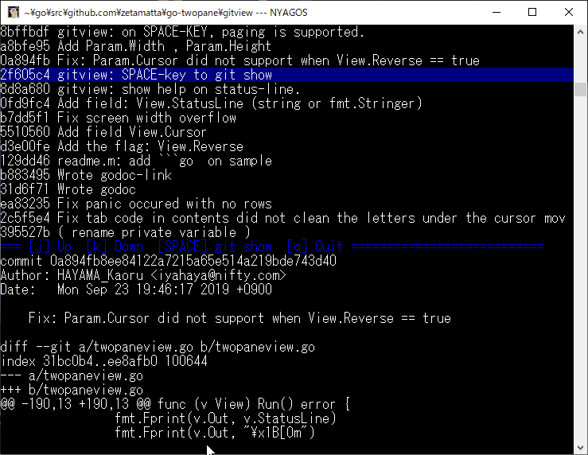

[](https://godoc.org/github.com/zetamatta/go-twopane)

Two pane text viewing library for Go
===================================

```go
package main

import (
	"fmt"
	"os"

	"github.com/zetamatta/go-twopane"
)

type Row string

func (r Row) Title(_ interface{}) string {
	return string(r)
}

func (r Row) Contents(_ interface{}) []string {
	return []string{"Contents of " + string(r)}
}

func main() {
	rows := []twopane.Row{}
	for i := 0; i < 100; i++ {
		rows = append(rows, Row(fmt.Sprintf("%d", i)))
	}
	err := twopane.View{Rows: rows, Reverse: true}.Run()
	if err != nil {
		fmt.Fprintln(os.Stderr, err.Error())
		os.Exit(1)
	}
}
```

Sample Application (git viewer)
-------------------------------

[Source code](./gitview/main.go)



